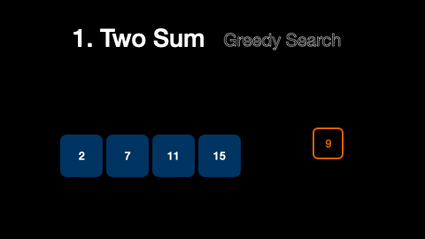

# [1. Two Sum](https://leetcode.com/problems/two-sum)

## Description

<p>Given an array of integers <code>nums</code>&nbsp;and an integer <code>target</code>, return <em>indices of the two numbers such that they add up to <code>target</code></em>.</p>

<p>You may assume that each input would have <strong><em>exactly</em> one solution</strong>, and you may not use the <em>same</em> element twice.</p>

<p>You can return the answer in any order.</p>

<p>&nbsp;</p>
<p><strong>Example 1:</strong></p>

<pre>
<strong>Input:</strong> nums = [2,7,11,15], target = 9
<strong>Output:</strong> [0,1]
<strong>Output:</strong> Because nums[0] + nums[1] == 9, we return [0, 1].
</pre>

<p><strong>Example 2:</strong></p>

<pre>
<strong>Input:</strong> nums = [3,2,4], target = 6
<strong>Output:</strong> [1,2]
</pre>

<p><strong>Example 3:</strong></p>

<pre>
<strong>Input:</strong> nums = [3,3], target = 6
<strong>Output:</strong> [0,1]
</pre>

<p>&nbsp;</p>
<p><strong>Constraints:</strong></p>

<ul>
	<li><code>2 &lt;= nums.length &lt;= 10<sup>3</sup></code></li>
	<li><code>-10<sup>9</sup> &lt;= nums[i] &lt;= 10<sup>9</sup></code></li>
	<li><code>-10<sup>9</sup> &lt;= target &lt;= 10<sup>9</sup></code></li>
	<li><strong>Only one valid answer exists.</strong></li>
</ul>


## Animation


## Solutions
### **Python**
```python
# Greedy Search
class Solution:
    def twoSum(self, nums: List[int], target: int) -> List[int]:
		n = len(nums)
		for i in range(n-1):
			for j in range(i+1, n):
				if nums[i] + nums[j] == target:
					return [i, j]

					
# Hash Table
class Solution:
    def twoSum(self, nums: List[int], target: int) -> List[int]:
        helper = {}
        for i, v in enumerate(nums):
            num = target - v
            if num in helper:
                return [helper[num], i]
            helper[v] = i
```

